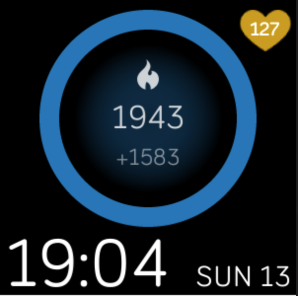
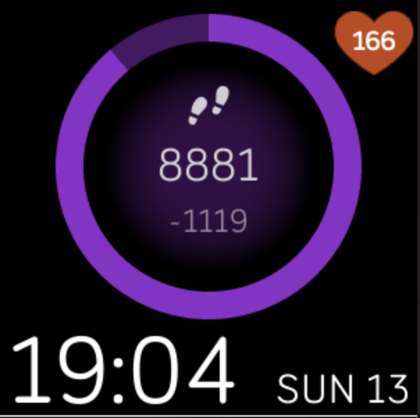
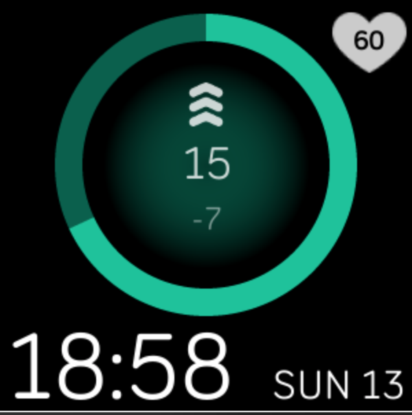

# fitbit-clock
My first clock for Fitbit Versa

The clockface features three stats: calories, steps and active zone minutes. The stats currently displayed can be changed by tapping the screen.
The heart icon pulses when heartrate is detected.

